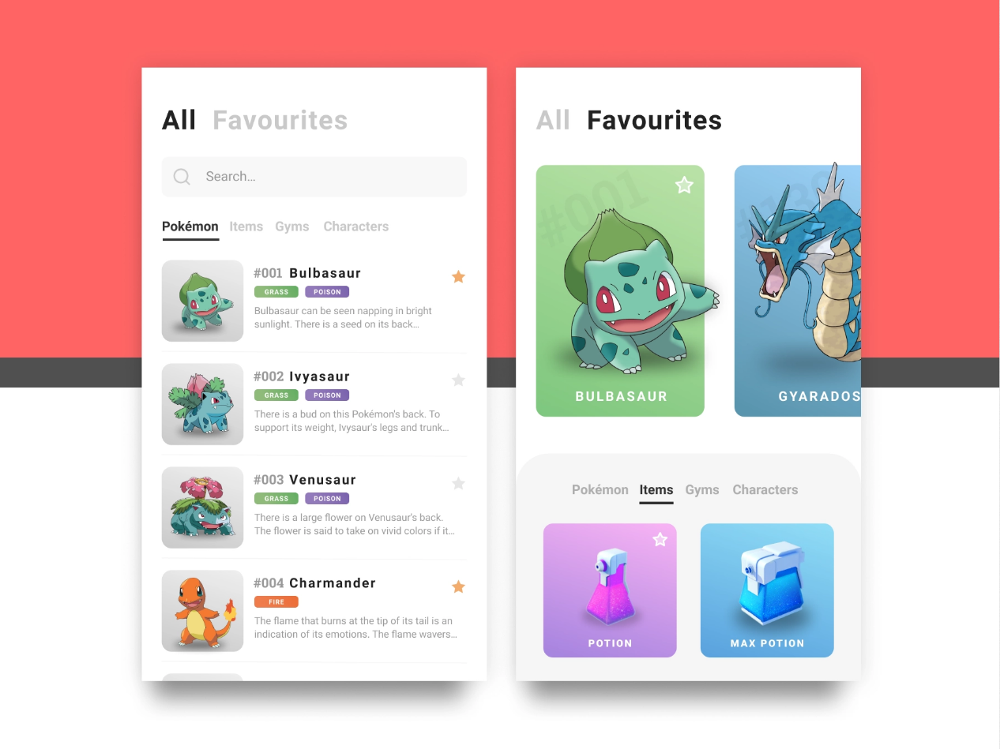

# PokemonApp

Pokemon app nos ayudara a realizar peticiones HTTP a una API publica.

## Instalacion

Despues de clonar o descargar el proyecto, llevalo a tu editor de codigo favorito, y ejecuta el siguiente comando en la terminal:

```bash
flutter packages get
```
Diseno basado en: https://dribbble.com/shots/6740869-DailyUI-044-Favourites



